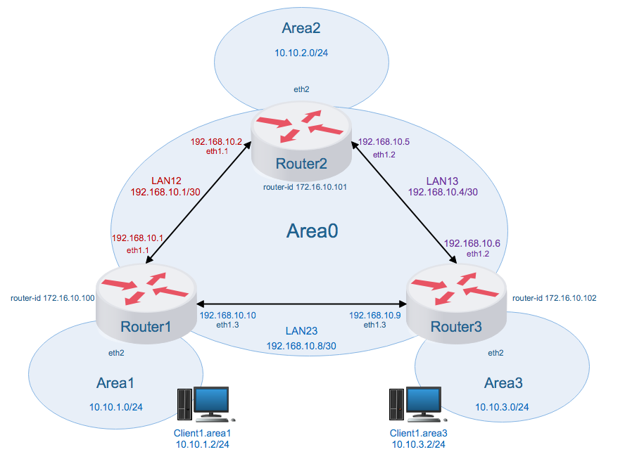
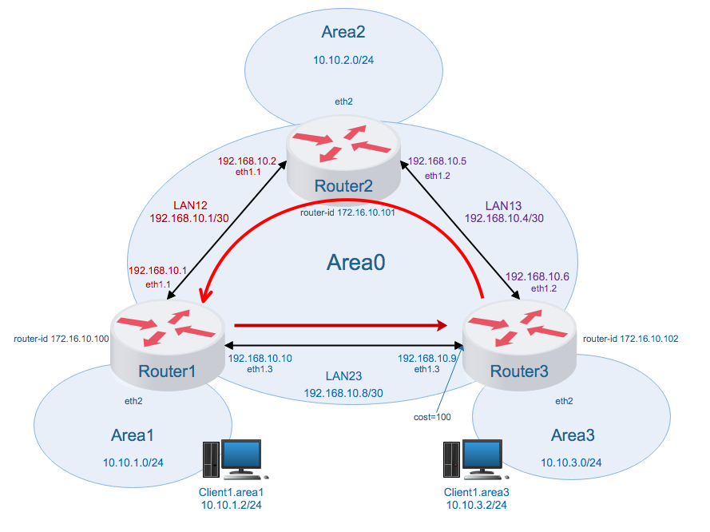
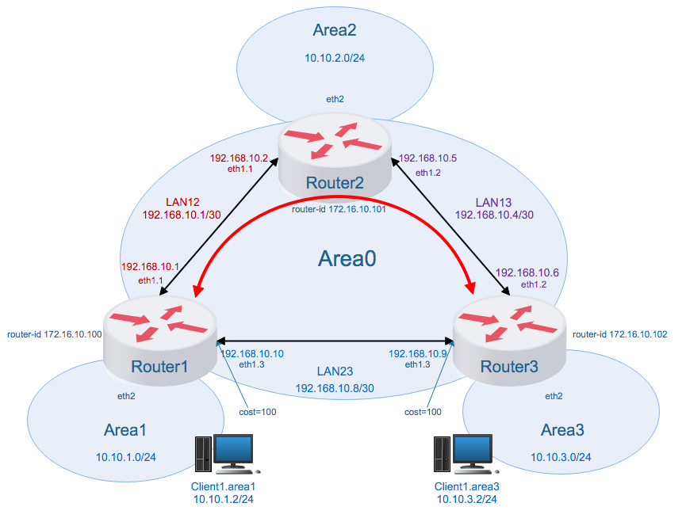

# ospf

### 1. Общая конфигурация



Создаем три вуртуальные машины: Router1, Router2, Router3 и соединяеим их согласно схеме:

#### 1.1 Router1:

|Интерфейс|Точка подключения|ip-адрес|VLAN|Area
|:---:|:---:|---|---|---|
|eth1.1|Router2 - eth1.1|192.168.10.1/30|LAN12|Area0
|eth1.3|Router3 - eth1.3|192.168.10.10/30|LAN23|Area0
|eth2|Client1 - eth1|10.10.1.1/24||Area1
|loopback|-|172.16.10.100/32|||

#### 1.2 Router2 

|Интерфейс|Точка подключения|ip-адрес|VLAN|Area
|:---:|:---:|---|---|---|
|eth1.1|Router1 eth1.1|192.168.10.2/30|LAN12|Area0
|eth1.2|Router3 eth1.2|192.168.10.5/30|LAN13|Area0
|eth2|Area2 - eth1|10.10.2.1/24||Area2
|loopback|-|172.16.10.101/32||

#### 1.3 Router3

|Интерфейс|Точка подключения|ip-адрес|VLAN|Area|
|:---:|:---:|---|---|---|
|eth1.2|Router2 eth1.2|192.168.10.6/30|LAN13|Area0
|eth1.3|Router1 eth1.3|192.168.10.9/30|LAN23|Area0
|eth2|Client1 - eth1|10.10.3.1/24||Area3
|loopback|-|172.16.10.102/32|||


#### 1.4 Подсети
##### 1.4.1 LAN12

|Подсеть|Min IP|Max IP|Broadcast|Hosts|Mask|
|---|---|---|---|:---:|---|
|192.168.10.1/30|192.168.10.1|192.168.10.2|192.168.10.3|2|255.255.255.252|

##### 1.4.2 LAN13

|Подсеть|Min IP|Max IP|Broadcast|Hosts|Mask|
|---|---|---|---|:---:|---|
|192.168.10.4/30|192.168.10.5|192.168.10.6|192.168.10.7|2|255.255.255.252|

##### 1.4.3 LAN23

|Подсеть|Min IP|Max IP|Broadcast|Hosts|Mask|
|---|---|---|---|:---:|---|
|192.168.10.4/30|192.168.10.9|192.168.10.10|192.168.10.11|2|255.255.255.252|

Конфигуруем интерфейсы через shell porvision vagrnat, устанавливаем `Quagga`. Добавляем на каждый роутер конфигурацию Quagga [daemons](etc/daemons), ospfd.conf для [router1](router1/ospfd.conf), [router2](router2/ospfd.conf), [router3](router3/ospfd.conf) и zebra.conf для [router1](router1/zebra.conf), [router2](router2/zebra.conf), [router3](router3/zebra.conf). Включаем и запускаем службы `zebra` и `ospfd`. Добавляем так же записи в [hosts](etc/hosts).

### 2. OSPF между машинами на базе Quagga

#### 2.1 Роутинг, с дефолтным значением cost на интерфейсах

##### 2.1.1 Вывод `ip a`.

<details>
<summary>Router1</summary>
<pre>
[vagrant@Router1 ~]$ ip a
1: lo: <LOOPBACK,UP,LOWER_UP> mtu 65536 qdisc noqueue state UNKNOWN group default qlen 1000
    link/loopback 00:00:00:00:00:00 brd 00:00:00:00:00:00
    inet 127.0.0.1/8 scope host lo
       valid_lft forever preferred_lft forever
    inet 172.16.10.100/32 scope global lo
       valid_lft forever preferred_lft forever
    inet6 ::1/128 scope host
       valid_lft forever preferred_lft forever
2: eth0: <BROADCAST,MULTICAST,UP,LOWER_UP> mtu 1500 qdisc pfifo_fast state UP group default qlen 1000
    link/ether 52:54:00:84:81:d5 brd ff:ff:ff:ff:ff:ff
    inet 10.0.2.15/24 brd 10.0.2.255 scope global noprefixroute dynamic eth0
       valid_lft 80441sec preferred_lft 80441sec
    inet6 fe80::5054:ff:fe84:81d5/64 scope link
       valid_lft forever preferred_lft forever
3: eth1: <BROADCAST,MULTICAST,UP,LOWER_UP> mtu 1500 qdisc pfifo_fast state UP group default qlen 1000
    link/ether 08:00:27:38:56:74 brd ff:ff:ff:ff:ff:ff
    inet6 fe80::5037:1609:2161:df3d/64 scope link noprefixroute
       valid_lft forever preferred_lft forever
4: eth2: <BROADCAST,MULTICAST,UP,LOWER_UP> mtu 1500 qdisc pfifo_fast state UP group default qlen 1000
    link/ether 08:00:27:62:7d:fc brd ff:ff:ff:ff:ff:ff
    inet 10.10.1.1/24 brd 10.10.1.255 scope global noprefixroute eth2
       valid_lft forever preferred_lft forever
    inet6 fe80::a00:27ff:fe62:7dfc/64 scope link
       valid_lft forever preferred_lft forever
5: eth1.1@eth1: <BROADCAST,MULTICAST,UP,LOWER_UP> mtu 1500 qdisc noqueue state UP group default qlen 1000
    link/ether 08:00:27:38:56:74 brd ff:ff:ff:ff:ff:ff
    inet 192.168.10.1/30 brd 192.168.10.3 scope global noprefixroute eth1.1
       valid_lft forever preferred_lft forever
    inet6 fe80::a00:27ff:fe38:5674/64 scope link
       valid_lft forever preferred_lft forever
6: eth1.3@eth1: <BROADCAST,MULTICAST,UP,LOWER_UP> mtu 1500 qdisc noqueue state UP group default qlen 1000
    link/ether 08:00:27:38:56:74 brd ff:ff:ff:ff:ff:ff
    inet 192.168.10.10/30 brd 192.168.10.11 scope global noprefixroute eth1.3
       valid_lft forever preferred_lft forever
    inet6 fe80::a00:27ff:fe38:5674/64 scope link
       valid_lft forever preferred_lft forever
</pre>
</details>

<details>
<summary>Router2</summary>
<pre>
[vagrant@Router2 ~]$ ip a
1: lo: <LOOPBACK,UP,LOWER_UP> mtu 65536 qdisc noqueue state UNKNOWN group default qlen 1000
    link/loopback 00:00:00:00:00:00 brd 00:00:00:00:00:00
    inet 127.0.0.1/8 scope host lo
       valid_lft forever preferred_lft forever
    inet 172.16.10.101/32 scope global lo
       valid_lft forever preferred_lft forever
    inet6 ::1/128 scope host
       valid_lft forever preferred_lft forever
2: eth0: <BROADCAST,MULTICAST,UP,LOWER_UP> mtu 1500 qdisc pfifo_fast state UP group default qlen 1000
    link/ether 52:54:00:84:81:d5 brd ff:ff:ff:ff:ff:ff
    inet 10.0.2.15/24 brd 10.0.2.255 scope global noprefixroute dynamic eth0
       valid_lft 80533sec preferred_lft 80533sec
    inet6 fe80::5054:ff:fe84:81d5/64 scope link
       valid_lft forever preferred_lft forever
3: eth1: <BROADCAST,MULTICAST,UP,LOWER_UP> mtu 1500 qdisc pfifo_fast state UP group default qlen 1000
    link/ether 08:00:27:84:a7:b1 brd ff:ff:ff:ff:ff:ff
    inet6 fe80::c054:b73b:16b8:e78b/64 scope link noprefixroute
       valid_lft forever preferred_lft forever
4: eth2: <BROADCAST,MULTICAST,UP,LOWER_UP> mtu 1500 qdisc pfifo_fast state UP group default qlen 1000
    link/ether 08:00:27:10:dd:48 brd ff:ff:ff:ff:ff:ff
    inet 10.10.2.1/24 brd 10.10.2.255 scope global noprefixroute eth2
       valid_lft forever preferred_lft forever
    inet6 fe80::a00:27ff:fe10:dd48/64 scope link
       valid_lft forever preferred_lft forever
5: eth1.1@eth1: <BROADCAST,MULTICAST,UP,LOWER_UP> mtu 1500 qdisc noqueue state UP group default qlen 1000
    link/ether 08:00:27:84:a7:b1 brd ff:ff:ff:ff:ff:ff
    inet 192.168.10.2/30 brd 192.168.10.3 scope global noprefixroute eth1.1
       valid_lft forever preferred_lft forever
    inet6 fe80::a00:27ff:fe84:a7b1/64 scope link
       valid_lft forever preferred_lft forever
6: eth1.2@eth1: <BROADCAST,MULTICAST,UP,LOWER_UP> mtu 1500 qdisc noqueue state UP group default qlen 1000
    link/ether 08:00:27:84:a7:b1 brd ff:ff:ff:ff:ff:ff
    inet 192.168.10.5/30 brd 192.168.10.7 scope global noprefixroute eth1.2
       valid_lft forever preferred_lft forever
    inet6 fe80::a00:27ff:fe84:a7b1/64 scope link
       valid_lft forever preferred_lft forever
</pre>
</details>

<details>
<summary>Router3</summary>
<pre>
[vagrant@Router3 ~]$ ip a
1: lo: <LOOPBACK,UP,LOWER_UP> mtu 65536 qdisc noqueue state UNKNOWN group default qlen 1000
    link/loopback 00:00:00:00:00:00 brd 00:00:00:00:00:00
    inet 127.0.0.1/8 scope host lo
       valid_lft forever preferred_lft forever
    inet 172.16.10.102/32 scope global lo
       valid_lft forever preferred_lft forever
    inet6 ::1/128 scope host
       valid_lft forever preferred_lft forever
2: eth0: <BROADCAST,MULTICAST,UP,LOWER_UP> mtu 1500 qdisc pfifo_fast state UP group default qlen 1000
    link/ether 52:54:00:84:81:d5 brd ff:ff:ff:ff:ff:ff
    inet 10.0.2.15/24 brd 10.0.2.255 scope global noprefixroute dynamic eth0
       valid_lft 80621sec preferred_lft 80621sec
    inet6 fe80::5054:ff:fe84:81d5/64 scope link
       valid_lft forever preferred_lft forever
3: eth1: <BROADCAST,MULTICAST,UP,LOWER_UP> mtu 1500 qdisc pfifo_fast state UP group default qlen 1000
    link/ether 08:00:27:98:5c:de brd ff:ff:ff:ff:ff:ff
    inet6 fe80::8cc1:7da8:78ce:4437/64 scope link noprefixroute
       valid_lft forever preferred_lft forever
4: eth2: <BROADCAST,MULTICAST,UP,LOWER_UP> mtu 1500 qdisc pfifo_fast state UP group default qlen 1000
    link/ether 08:00:27:00:69:33 brd ff:ff:ff:ff:ff:ff
    inet 10.10.3.1/24 brd 10.10.3.255 scope global noprefixroute eth2
       valid_lft forever preferred_lft forever
    inet6 fe80::a00:27ff:fe00:6933/64 scope link
       valid_lft forever preferred_lft forever
5: eth1.2@eth1: <BROADCAST,MULTICAST,UP,LOWER_UP> mtu 1500 qdisc noqueue state UP group default qlen 1000
    link/ether 08:00:27:98:5c:de brd ff:ff:ff:ff:ff:ff
    inet 192.168.10.6/30 brd 192.168.10.7 scope global noprefixroute eth1.2
       valid_lft forever preferred_lft forever
    inet6 fe80::a00:27ff:fe98:5cde/64 scope link
       valid_lft forever preferred_lft forever
6: eth1.3@eth1: <BROADCAST,MULTICAST,UP,LOWER_UP> mtu 1500 qdisc noqueue state UP group default qlen 1000
    link/ether 08:00:27:98:5c:de brd ff:ff:ff:ff:ff:ff
    inet 192.168.10.9/30 brd 192.168.10.11 scope global noprefixroute eth1.3
       valid_lft forever preferred_lft forever
    inet6 fe80::a00:27ff:fe98:5cde/64 scope link
       valid_lft forever preferred_lft forever
</pre>
</details>

##### 2.1.2 Вывод `tracepath`.

<details>
<summary>Router1</summary>
<pre>
[vagrant@Router1 ~]$ for q in 192.168.10.2 192.168.10.5 192.168.10.6 192.168.10.9; do tracepath -b "$q"; done
 1?: [LOCALHOST]                                         pmtu 1500
 1:  router2 (192.168.10.2)                                0.524ms reached
 1:  router2 (192.168.10.2)                                0.542ms reached
     Resume: pmtu 1500 hops 1 back 1
 1?: [LOCALHOST]                                         pmtu 1500
 1:  router2-eth12 (192.168.10.5)                          0.484ms reached
 1:  router2-eth12 (192.168.10.5)                          0.909ms reached
     Resume: pmtu 1500 hops 1 back 1
 1?: [LOCALHOST]                                         pmtu 1500
 1:  router2 (192.168.10.2)                                0.588ms
 1:  router2 (192.168.10.2)                                0.445ms
 2:  router3 (192.168.10.6)                                0.780ms reached
     Resume: pmtu 1500 hops 2 back 1
 1?: [LOCALHOST]                                         pmtu 1500
 1:  router3-eth13 (192.168.10.9)                          0.704ms reached
 1:  router3-eth13 (192.168.10.9)                          0.819ms reached
     Resume: pmtu 1500 hops 1 back 1
</pre>
</details>

<details>
<summary>Router2</summary>
<pre>
[vagrant@Router2 ~]$ for q in 192.168.10.1 192.168.10.10 192.168.10.9 192.168.10.6; do tracepath -b "$q"; done
 1?: [LOCALHOST]                                         pmtu 1500
 1:  router1 (192.168.10.1)                                1.738ms reached
 1:  router1 (192.168.10.1)                                0.754ms reached
     Resume: pmtu 1500 hops 1 back 1
 1?: [LOCALHOST]                                         pmtu 1500
 1:  router3 (192.168.10.6)                                0.995ms
 1:  router3 (192.168.10.6)                                1.658ms
 2:  router1-eth13 (192.168.10.10)                         2.060ms reached
     Resume: pmtu 1500 hops 2 back 2
 1?: [LOCALHOST]                                         pmtu 1500
 1:  router1 (192.168.10.1)                                0.645ms
 1:  router1 (192.168.10.1)                                0.811ms
 2:  router3-eth13 (192.168.10.9)                          0.811ms reached
     Resume: pmtu 1500 hops 2 back 1
 1?: [LOCALHOST]                                         pmtu 1500
 1:  router3 (192.168.10.6)                                0.781ms reached
 1:  router3 (192.168.10.6)                                0.639ms reached
     Resume: pmtu 1500 hops 1 back 1
</pre>
</details>

<details>
<summary>Router3</summary>
<pre>
[vagrant@Router3 ~]$ for q in 192.168.10.1 192.168.10.2 192.168.10.5 192.168.10.10; do tracepath -b "$q"; done
 1?: [LOCALHOST]                                         pmtu 1500
 1:  router2-eth12 (192.168.10.5)                          0.496ms
 1:  router2-eth12 (192.168.10.5)                          1.079ms
 2:  router1 (192.168.10.1)                                0.773ms reached
     Resume: pmtu 1500 hops 2 back 1
 1?: [LOCALHOST]                                         pmtu 1500
 1:  router2 (192.168.10.2)                                0.950ms reached
 1:  router2 (192.168.10.2)                                1.011ms reached
     Resume: pmtu 1500 hops 1 back 1
 1?: [LOCALHOST]                                         pmtu 1500
 1:  router2-eth12 (192.168.10.5)                          0.869ms reached
 1:  router2-eth12 (192.168.10.5)                          0.681ms reached
     Resume: pmtu 1500 hops 1 back 1
 1?: [LOCALHOST]                                         pmtu 1500
 1:  router1-eth13 (192.168.10.10)                         0.742ms reached
 1:  router1-eth13 (192.168.10.10)                         0.599ms reached
     Resume: pmtu 1500 hops 1 back 1
</pre>
</details>

#### 2.2 Ассимметричный роутинг

На роутере `Router3` на интерфейсе `eth1.3` выставим параметр `cost=100`. Маршрут от `Router3` к `Router1` будут построен через `Router2` (LAN13 - LAN12), от `Router1` к `Router3`, пакеты должны возвращаться через LAN23. 



```
$ vtysh
Router1# conf t
Router1(config-if)# int eth1.3
Router1(config-if)# ip ospf cost 100
```

##### 2.2.1 Вывод `ip a`.

<details>
<summary>Router1</summary>
<pre>
[vagrant@Router1 ~]$ ip -br a
lo               UNKNOWN        127.0.0.1/8 172.16.10.100/32 ::1/128
eth0             UP             10.0.2.15/24 fe80::5054:ff:fe84:81d5/64
eth1             UP             fe80::5037:1609:2161:df3d/64
eth1.3@eth1      UP             192.168.10.10/30 fe80::a00:27ff:fe38:5674/64
eth1.1@eth1      UP             192.168.10.1/30 fe80::a00:27ff:fe38:5674/64
eth2             UP             10.10.1.1/24 fe80::a00:27ff:fe62:7dfc/64
</pre>
</details>

<details>
<summary>Router2</summary>
<pre>
[vagrant@Router2 ~]$ ip -br a
lo               UNKNOWN        127.0.0.1/8 172.16.10.101/32 ::1/128
eth0             UP             10.0.2.15/24 fe80::5054:ff:fe84:81d5/64
eth1             UP             fe80::c054:b73b:16b8:e78b/64
eth1.1@eth1      UP             192.168.10.2/30 fe80::a00:27ff:fe84:a7b1/64
eth1.2@eth1      UP             192.168.10.5/30 fe80::a00:27ff:fe84:a7b1/64
eth2             UP             10.10.2.1/24 fe80::a00:27ff:fe10:dd48/64
</pre>
</details>

<details>
<summary>Router3</summary>
<pre>
[vagrant@Router3 ~]$ ip -br a
lo               UNKNOWN        127.0.0.1/8 172.16.10.102/32 ::1/128
eth0             UP             10.0.2.15/24 fe80::5054:ff:fe84:81d5/64
eth1             UP             fe80::8cc1:7da8:78ce:4437/64
eth1.3@eth1      UP             192.168.10.9/30 fe80::a00:27ff:fe98:5cde/64
eth1.2@eth1      UP             192.168.10.6/30 fe80::a00:27ff:fe98:5cde/64
eth2             UP             10.10.3.1/24 fe80::a00:27ff:fe00:6933/64
</pre>
</details>

##### 2.2.2 Вывод `tracepath`.

<details>
<summary>Router1</summary>
<pre>
[vagrant@Router1 ~]$ for q in 192.168.10.2 192.168.10.9 192.168.10.5 192.168.10.6; do tracepath -b "$q"; done
 1?: [LOCALHOST]                                         pmtu 1500
 1:  router2 (192.168.10.2)                                0.580ms reached
 1:  router2 (192.168.10.2)                                0.654ms reached
     Resume: pmtu 1500 hops 1 back 1
 1?: [LOCALHOST]                                         pmtu 1500
 1:  router3-eth13 (192.168.10.9)                          0.723ms reached
 1:  router3-eth13 (192.168.10.9)                          0.571ms reached
     Resume: pmtu 1500 hops 1 back 1
 1?: [LOCALHOST]                                         pmtu 1500
 1:  router3-eth13 (192.168.10.9)                          0.683ms
 1:  router3-eth13 (192.168.10.9)                          0.499ms
 2:  no reply
</pre>
</details>

<details>
<summary>Router2</summary>
<pre>
[vagrant@Router2 ~]$ for q in 192.168.10.1 192.168.10.6 192.168.10.10 192.168.10.9; do tracepath -b "$q"; done
 1?: [LOCALHOST]                                         pmtu 1500
 1:  router1 (192.168.10.1)                                0.670ms reached
 1:  router1 (192.168.10.1)                                0.667ms reached
     Resume: pmtu 1500 hops 1 back 1
 1?: [LOCALHOST]                                         pmtu 1500
 1:  router3 (192.168.10.6)                                0.548ms reached
 1:  router3 (192.168.10.6)                                0.598ms reached
     Resume: pmtu 1500 hops 1 back 1
 1?: [LOCALHOST]                                         pmtu 1500
 1:  router1-eth13 (192.168.10.10)                         1.029ms reached
 1:  router1-eth13 (192.168.10.10)                         0.568ms reached
     Resume: pmtu 1500 hops 1 back 1
 1?: [LOCALHOST]                                         pmtu 1500
 1:  router1 (192.168.10.1)                                1.268ms
 1:  router1 (192.168.10.1)                                1.026ms
 2:  no reply
</pre>
</details>

<details>
<summary>Router3</summary>
<pre>
[vagrant@Router3 ~]$ for q in 192.168.10.1 192.168.10.2 192.168.10.5 192.168.10.10; do tracepath -b "$q"; done
 1?: [LOCALHOST]                                         pmtu 1500
 1:  router2-eth12 (192.168.10.5)                          0.977ms
 1:  router2-eth12 (192.168.10.5)                          0.493ms
 2:  router1 (192.168.10.1)                                1.427ms reached
     Resume: pmtu 1500 hops 2 back 2
 1?: [LOCALHOST]                                         pmtu 1500
 1:  router2 (192.168.10.2)                                0.502ms reached
 1:  router2 (192.168.10.2)                                0.519ms reached
     Resume: pmtu 1500 hops 1 back 1
 1?: [LOCALHOST]                                         pmtu 1500
 1:  router2-eth12 (192.168.10.5)                          0.894ms reached
 1:  router2-eth12 (192.168.10.5)                          0.761ms reached
     Resume: pmtu 1500 hops 1 back 1
 1?: [LOCALHOST]                                         pmtu 1500
 1:  router1-eth13 (192.168.10.10)                         0.761ms reached
 1:  router1-eth13 (192.168.10.10)                         1.228ms reached
     Resume: pmtu 1500 hops 1 back 1
</pre>
</details>


#### 2.3 Симметричный роутинг

На роутерах `Router1` и `Router3` на интерфейсах eth1.3 выставим параметр `cost=100`. Маршрут от `Router3` к `Router1` будут поролегать через `Router2` (LAN13 - LAN12), от `Router1` к `Router3` пакеты должны возвращаться тем же маршрутом. 



##### 2.3.1 Вывод `ip a`.

<details>
<summary>Router1</summary>
<pre>
[vagrant@Router1 ~]$ ip a
1: lo: <LOOPBACK,UP,LOWER_UP> mtu 65536 qdisc noqueue state UNKNOWN group default qlen 1000
    link/loopback 00:00:00:00:00:00 brd 00:00:00:00:00:00
    inet 127.0.0.1/8 scope host lo
       valid_lft forever preferred_lft forever
    inet 172.16.10.100/32 scope global lo
       valid_lft forever preferred_lft forever
    inet6 ::1/128 scope host
       valid_lft forever preferred_lft forever
2: eth0: <BROADCAST,MULTICAST,UP,LOWER_UP> mtu 1500 qdisc pfifo_fast state UP group default qlen 1000
    link/ether 52:54:00:84:81:d5 brd ff:ff:ff:ff:ff:ff
    inet 10.0.2.15/24 brd 10.0.2.255 scope global noprefixroute dynamic eth0
       valid_lft 85892sec preferred_lft 85892sec
    inet6 fe80::5054:ff:fe84:81d5/64 scope link
       valid_lft forever preferred_lft forever
3: eth1: <BROADCAST,MULTICAST,UP,LOWER_UP> mtu 1500 qdisc pfifo_fast state UP group default qlen 1000
    link/ether 08:00:27:38:56:74 brd ff:ff:ff:ff:ff:ff
    inet6 fe80::5037:1609:2161:df3d/64 scope link noprefixroute
       valid_lft forever preferred_lft forever
4: eth1.3@eth1: <BROADCAST,MULTICAST,UP,LOWER_UP> mtu 1500 qdisc noqueue state UP group default qlen 1000
    link/ether 08:00:27:38:56:74 brd ff:ff:ff:ff:ff:ff
    inet 192.168.10.10/30 brd 192.168.10.11 scope global noprefixroute eth1.3
       valid_lft forever preferred_lft forever
    inet6 fe80::a00:27ff:fe38:5674/64 scope link
       valid_lft forever preferred_lft forever
5: eth1.1@eth1: <BROADCAST,MULTICAST,UP,LOWER_UP> mtu 1500 qdisc noqueue state UP group default qlen 1000
    link/ether 08:00:27:38:56:74 brd ff:ff:ff:ff:ff:ff
    inet 192.168.10.1/30 brd 192.168.10.3 scope global noprefixroute eth1.1
       valid_lft forever preferred_lft forever
    inet6 fe80::a00:27ff:fe38:5674/64 scope link
       valid_lft forever preferred_lft forever
6: eth2: <BROADCAST,MULTICAST,UP,LOWER_UP> mtu 1500 qdisc pfifo_fast state UP group default qlen 1000
    link/ether 08:00:27:62:7d:fc brd ff:ff:ff:ff:ff:ff
    inet 10.10.1.1/24 brd 10.10.1.255 scope global noprefixroute eth2
       valid_lft forever preferred_lft forever
    inet6 fe80::a00:27ff:fe62:7dfc/64 scope link
       valid_lft forever preferred_lft forever
</pre>
</details>

<details>
<summary>Router2</summary>
<pre>
[vagrant@Router2 ~]$ ip a
1: lo: <LOOPBACK,UP,LOWER_UP> mtu 65536 qdisc noqueue state UNKNOWN group default qlen 1000
    link/loopback 00:00:00:00:00:00 brd 00:00:00:00:00:00
    inet 127.0.0.1/8 scope host lo
       valid_lft forever preferred_lft forever
    inet 172.16.10.101/32 scope global lo
       valid_lft forever preferred_lft forever
    inet6 ::1/128 scope host
       valid_lft forever preferred_lft forever
2: eth0: <BROADCAST,MULTICAST,UP,LOWER_UP> mtu 1500 qdisc pfifo_fast state UP group default qlen 1000
    link/ether 52:54:00:84:81:d5 brd ff:ff:ff:ff:ff:ff
    inet 10.0.2.15/24 brd 10.0.2.255 scope global noprefixroute dynamic eth0
       valid_lft 85864sec preferred_lft 85864sec
    inet6 fe80::5054:ff:fe84:81d5/64 scope link
       valid_lft forever preferred_lft forever
3: eth1: <BROADCAST,MULTICAST,UP,LOWER_UP> mtu 1500 qdisc pfifo_fast state UP group default qlen 1000
    link/ether 08:00:27:84:a7:b1 brd ff:ff:ff:ff:ff:ff
    inet6 fe80::c054:b73b:16b8:e78b/64 scope link noprefixroute
       valid_lft forever preferred_lft forever
4: eth1.1@eth1: <BROADCAST,MULTICAST,UP,LOWER_UP> mtu 1500 qdisc noqueue state UP group default qlen 1000
    link/ether 08:00:27:84:a7:b1 brd ff:ff:ff:ff:ff:ff
    inet 192.168.10.2/30 brd 192.168.10.3 scope global noprefixroute eth1.1
       valid_lft forever preferred_lft forever
    inet6 fe80::a00:27ff:fe84:a7b1/64 scope link
       valid_lft forever preferred_lft forever
5: eth1.2@eth1: <BROADCAST,MULTICAST,UP,LOWER_UP> mtu 1500 qdisc noqueue state UP group default qlen 1000
    link/ether 08:00:27:84:a7:b1 brd ff:ff:ff:ff:ff:ff
    inet 192.168.10.5/30 brd 192.168.10.7 scope global noprefixroute eth1.2
       valid_lft forever preferred_lft forever
    inet6 fe80::a00:27ff:fe84:a7b1/64 scope link
       valid_lft forever preferred_lft forever
6: eth2: <BROADCAST,MULTICAST,UP,LOWER_UP> mtu 1500 qdisc pfifo_fast state UP group default qlen 1000
    link/ether 08:00:27:10:dd:48 brd ff:ff:ff:ff:ff:ff
    inet 10.10.2.1/24 brd 10.10.2.255 scope global noprefixroute eth2
       valid_lft forever preferred_lft forever
    inet6 fe80::a00:27ff:fe10:dd48/64 scope link
       valid_lft forever preferred_lft forever
</pre>
</details>

<details>
<summary>Router3</summary>
<pre>
[vagrant@Router3 ~]$ ip a
1: lo: <LOOPBACK,UP,LOWER_UP> mtu 65536 qdisc noqueue state UNKNOWN group default qlen 1000
    link/loopback 00:00:00:00:00:00 brd 00:00:00:00:00:00
    inet 127.0.0.1/8 scope host lo
       valid_lft forever preferred_lft forever
    inet 172.16.10.102/32 scope global lo
       valid_lft forever preferred_lft forever
    inet6 ::1/128 scope host
       valid_lft forever preferred_lft forever
2: eth0: <BROADCAST,MULTICAST,UP,LOWER_UP> mtu 1500 qdisc pfifo_fast state UP group default qlen 1000
    link/ether 52:54:00:84:81:d5 brd ff:ff:ff:ff:ff:ff
    inet 10.0.2.15/24 brd 10.0.2.255 scope global noprefixroute dynamic eth0
       valid_lft 85868sec preferred_lft 85868sec
    inet6 fe80::5054:ff:fe84:81d5/64 scope link
       valid_lft forever preferred_lft forever
3: eth1: <BROADCAST,MULTICAST,UP,LOWER_UP> mtu 1500 qdisc pfifo_fast state UP group default qlen 1000
    link/ether 08:00:27:98:5c:de brd ff:ff:ff:ff:ff:ff
    inet6 fe80::8cc1:7da8:78ce:4437/64 scope link noprefixroute
       valid_lft forever preferred_lft forever
4: eth1.3@eth1: <BROADCAST,MULTICAST,UP,LOWER_UP> mtu 1500 qdisc noqueue state UP group default qlen 1000
    link/ether 08:00:27:98:5c:de brd ff:ff:ff:ff:ff:ff
    inet 192.168.10.9/30 brd 192.168.10.11 scope global noprefixroute eth1.3
       valid_lft forever preferred_lft forever
    inet6 fe80::a00:27ff:fe98:5cde/64 scope link
       valid_lft forever preferred_lft forever
5: eth1.2@eth1: <BROADCAST,MULTICAST,UP,LOWER_UP> mtu 1500 qdisc noqueue state UP group default qlen 1000
    link/ether 08:00:27:98:5c:de brd ff:ff:ff:ff:ff:ff
    inet 192.168.10.6/30 brd 192.168.10.7 scope global noprefixroute eth1.2
       valid_lft forever preferred_lft forever
    inet6 fe80::a00:27ff:fe98:5cde/64 scope link
       valid_lft forever preferred_lft forever
6: eth2: <BROADCAST,MULTICAST,UP,LOWER_UP> mtu 1500 qdisc pfifo_fast state UP group default qlen 1000
    link/ether 08:00:27:00:69:33 brd ff:ff:ff:ff:ff:ff
    inet 10.10.3.1/24 brd 10.10.3.255 scope global noprefixroute eth2
       valid_lft forever preferred_lft forever
    inet6 fe80::a00:27ff:fe00:6933/64 scope link
       valid_lft forever preferred_lft forever
</pre>
</details>

##### 2.3.2 Вывод `tracepath`.

<details>
<summary>Router1</summary>
<pre>
[vagrant@Router1 ~]$ for q in 192.168.10.2 192.168.10.5 192.168.10.6 192.168.10.9; do tracepath -b "$q"; done
 1?: [LOCALHOST]                                         pmtu 1500
 1:  router2 (192.168.10.2)                                0.565ms reached
 1:  router2 (192.168.10.2)                                0.542ms reached
     Resume: pmtu 1500 hops 1 back 1
 1?: [LOCALHOST]                                         pmtu 1500
 1:  router2-eth12 (192.168.10.5)                          0.820ms reached
 1:  router2-eth12 (192.168.10.5)                          0.679ms reached
     Resume: pmtu 1500 hops 1 back 1
 1?: [LOCALHOST]                                         pmtu 1500
 1:  router2 (192.168.10.2)                                0.955ms
 1:  router2 (192.168.10.2)                                1.026ms
 2:  router3 (192.168.10.6)                                1.464ms reached
     Resume: pmtu 1500 hops 2 back 2
 1?: [LOCALHOST]                                         pmtu 1500
 1:  router3-eth13 (192.168.10.9)                          0.472ms reached
 1:  router3-eth13 (192.168.10.9)                          1.051ms reached
     Resume: pmtu 1500 hops 1 back 1
</pre>
</details>

<details>
<summary>Router2</summary>
<pre>
[vagrant@Router2 ~]$ for q in 192.168.10.1 192.168.10.10 192.168.10.9 192.168.10.6; do tracepath -b "$q"; done
 1?: [LOCALHOST]                                         pmtu 1500
 1:  router1 (192.168.10.1)                                0.632ms reached
 1:  router1 (192.168.10.1)                                0.439ms reached
     Resume: pmtu 1500 hops 1 back 1
 1?: [LOCALHOST]                                         pmtu 1500
 1:  router3 (192.168.10.6)                                1.349ms
 1:  router3 (192.168.10.6)                                0.702ms
 2:  router1-eth13 (192.168.10.10)                         0.752ms reached
     Resume: pmtu 1500 hops 2 back 1
 1?: [LOCALHOST]                                         pmtu 1500
 1:  router3-eth13 (192.168.10.9)                          0.762ms reached
 1:  router3-eth13 (192.168.10.9)                          0.549ms reached
     Resume: pmtu 1500 hops 1 back 1
 1?: [LOCALHOST]                                         pmtu 1500
 1:  router3 (192.168.10.6)                                1.378ms reached
 1:  router3 (192.168.10.6)                                0.834ms reached
     Resume: pmtu 1500 hops 1 back 1
</pre>
</details>

<details>
<summary>Router3</summary>
<pre>
[vagrant@Router3 ~]$ for q in 192.168.10.1 192.168.10.2 192.168.10.5 192.168.10.10; do tracepath -b "$q"; done
 1?: [LOCALHOST]                                         pmtu 1500
 1:  router2-eth12 (192.168.10.5)                          0.598ms
 1:  router2-eth12 (192.168.10.5)                          0.649ms
 2:  router1 (192.168.10.1)                                1.138ms reached
     Resume: pmtu 1500 hops 2 back 2
 1?: [LOCALHOST]                                         pmtu 1500
 1:  router2 (192.168.10.2)                                0.848ms reached
 1:  router2 (192.168.10.2)                                0.440ms reached
     Resume: pmtu 1500 hops 1 back 1
 1?: [LOCALHOST]                                         pmtu 1500
 1:  router2-eth12 (192.168.10.5)                          0.633ms reached
 1:  router2-eth12 (192.168.10.5)                          0.610ms reached
     Resume: pmtu 1500 hops 1 back 1
 1?: [LOCALHOST]                                         pmtu 1500
 1:  router1-eth13 (192.168.10.10)                         0.739ms reached
 1:  router1-eth13 (192.168.10.10)                         0.902ms reached
     Resume: pmtu 1500 hops 1 back 1
</pre>
</details>

### 3. Роутинг подсетей Area1 - Area2 - Area3 

- На роутерах на всех интерфейсах выставим параметр `cost=1`. Тестируем прохождение пакетов: client1.area3 <-> client1.area1.

<details>
<summary>Client1.Area3</summary>
<pre>
$ tracepath -b 10.10.1.2
 1?: [LOCALHOST]                                         pmtu 1500
 1:  router3-eth2 (10.10.3.1)                              0.634ms
 1:  router3-eth2 (10.10.3.1)                              0.531ms
 2:  router1-eth13 (192.168.10.10)                         0.863ms
 3:  client1.area1 (10.10.1.2)                             1.035ms reached
     Resume: pmtu 1500 hops 3 back 3
</pre>
</details>

- На роутерах `Router1` и `Router3` на интерфейсах eth1.3 выставим параметр `cost=100`.

<details>
<summary>Client1.Area3</summary>
<pre>
$ tracepath -b 10.10.1.2
 1?: [LOCALHOST]                                         pmtu 1500
 1:  router3-eth2 (10.10.3.1)                              0.583ms
 1:  router3-eth2 (10.10.3.1)                              0.812ms
 2:  router2-eth12 (192.168.10.5)                          1.055ms
 3:  router1 (192.168.10.1)                                1.107ms
 4:  client1.area1 (10.10.1.2)                             1.811ms reached
     Resume: pmtu 1500 hops 4 back 4
</pre>
</details>
